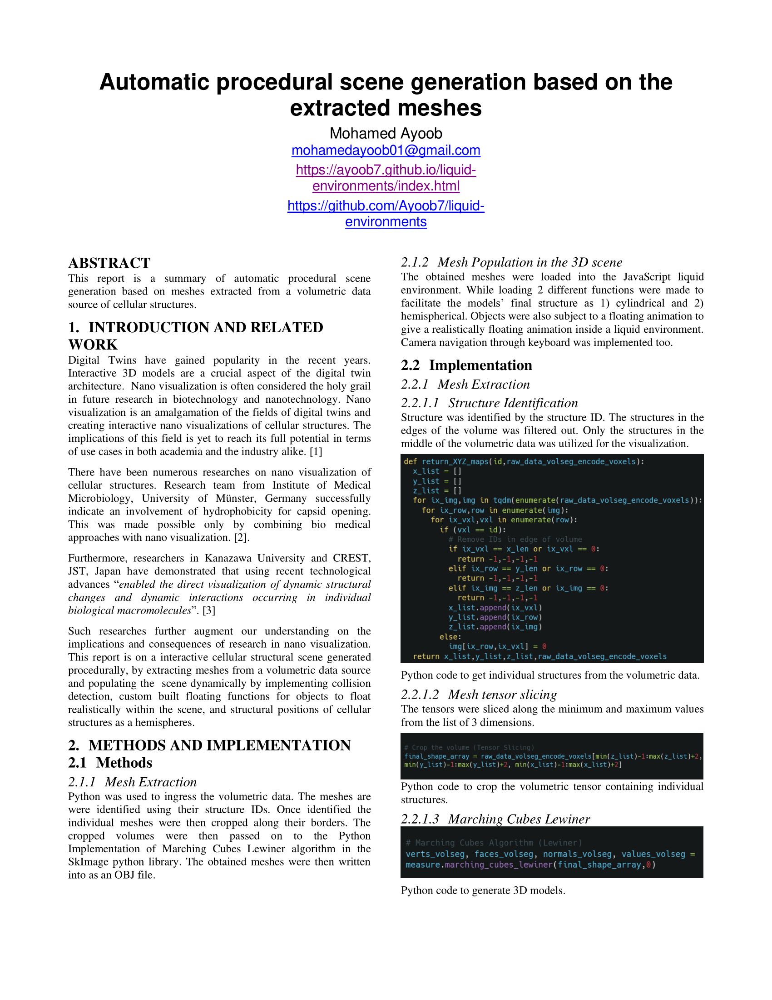
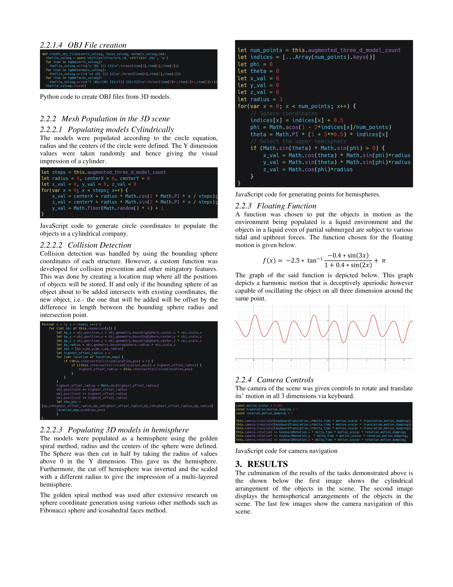
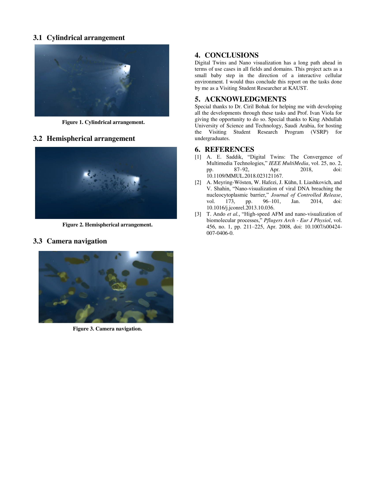

# Real-time Rendering of Liquid Environments

This project was developed during my time as a visiting student researcher at King Abdullah University of Science and Technology. A live demo of the application is available [here](https://ayoob7.github.io/liquid-environments/).

## Abstract 

This thesis presents a way of rendering scenes that are completely submerged in liquids, also referred to as liquid environments.
Liquids are the source of unique optical and physical phenomena such as light scattering, light extinction, turbulent flow, and the presence of foreign particles.
Each phenomenon is approached separately, using various techniques to create a visual effect that approximates it.
These effects are then combined into a generalized model, which can simulate the appearance of liquid environments with configurable physical properties.
The model is implemented in a platform-independent manner using JavaScript and WebGL.
Additionally, it achieves interactive performance by heavily utilizing graphical hardware, making it suitable for real-time applications.
A performance evaluation is also done, comparing the computational cost of each effect, as well as the complete model in practical situations.

## Examples

The following is a report based on what was developed.

